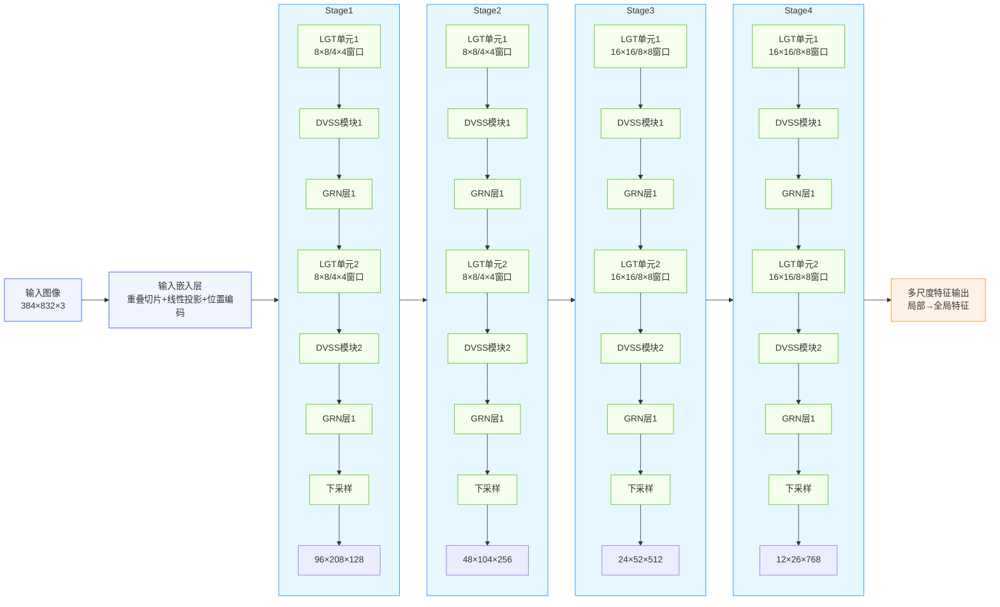
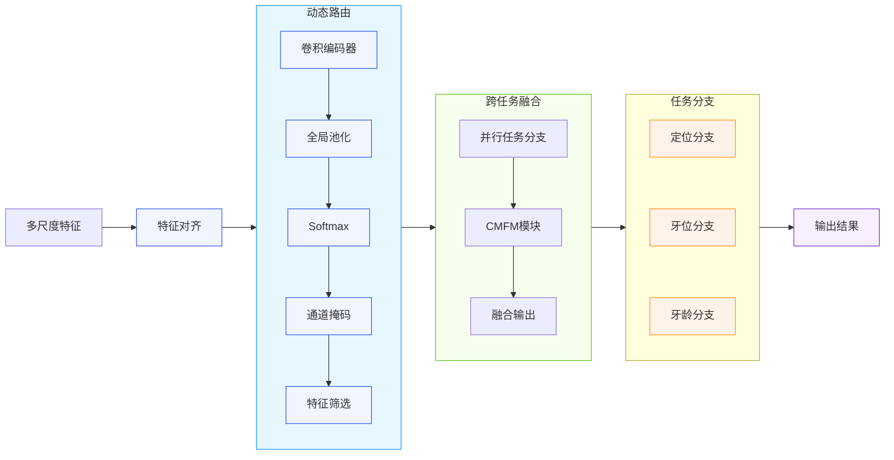

```mermaid
graph LR
    %% 输入层
    Input[输入图像<br>384×832×3] --> Embed[输入嵌入层<br>重叠切片+线性投影+位置编码]
    
    %% Stage1（垂直排列所有模块）
    subgraph Stage1
        LGT1[LGT单元1<br>8×8/4×4窗口]
        LGT1 --> DVSS1[DVSS模块1]
        DVSS1 --> GRN1[GRN层1]
        GRN1 --> LGT2[LGT单元2<br>8×8/4×4窗口]
        LGT2 --> DVSS2[DVSS模块2]
        DVSS2 --> GRN2[GRN层1]
        GRN2 --> Down1[下采样]
        Down1 --> Out1[96×208×128]
    end
    
    %% Stage2（同Stage1结构）
    subgraph Stage2
        LGT3[LGT单元1<br>8×8/4×4窗口]
        LGT3 --> DVSS3[DVSS模块1]
        DVSS3 --> GRN3[GRN层1]
        GRN3 --> LGT4[LGT单元2<br>8×8/4×4窗口]
        LGT4 --> DVSS4[DVSS模块2]
        DVSS4 --> GRN4[GRN层1]
        GRN4 --> Down2[下采样]
        Down2 --> Out2[48×104×256]
    end
    
    %% Stage3（同Stage1结构）
    subgraph Stage3
        LGT5[LGT单元1<br>16×16/8×8窗口]
        LGT5 --> DVSS5[DVSS模块1]
        DVSS5 --> GRN5[GRN层1]
        GRN5 --> LGT6[LGT单元2<br>16×16/8×8窗口]
        LGT6 --> DVSS6[DVSS模块2]
        DVSS6 --> GRN6[GRN层1]
        GRN6 --> Down3[下采样]
        Down3 --> Out3[24×52×512]
    end
    
    %% Stage4（同Stage1结构）
    subgraph Stage4
        LGT7[LGT单元1<br>16×16/8×8窗口]
        LGT7 --> DVSS7[DVSS模块1]
        DVSS7 --> GRN7[GRN层1]
        GRN7 --> LGT8[LGT单元2<br>16×16/8×8窗口]
        LGT8 --> DVSS8[DVSS模块2]
        DVSS8 --> GRN8[GRN层1]
        GRN8 --> Down4[下采样]
        Down4 --> Out4[12×26×768]
    end
    
    %% 输出层
    Output[多尺度特征输出<br>局部→全局特征]
    
    %% 水平连接
    Embed --> Stage1
    Stage1 --> Stage2
    Stage2 --> Stage3
    Stage3 --> Stage4
    Stage4 --> Output
    
    %% 样式定义
    classDef stage fill:#e6f7ff,stroke:#1890ff,stroke-width:1px;
    classDef component fill:#f6ffed,stroke:#52c41a,stroke-width:1px;
    classDef input fill:#f0f5ff,stroke:#2f54eb,stroke-width:1px;
    classDef output fill:#fff2e8,stroke:#fa8c16,stroke-width:1px;
    
    class Stage1,Stage2,Stage3,Stage4 stage;
    class LGT1,LGT2,LGT3,LGT4,LGT5,LGT6,LGT7,LGT8,DVSS1,DVSS2,DVSS3,DVSS4,DVSS5,DVSS6,DVSS7,DVSS8,GRN1,GRN2,GRN3,GRN4,GRN5,GRN6,GRN7,GRN8,Down1,Down2,Down3,Down4 component;
    class Input,Embed input;
    class Output output;
```

```mermaid
graph LR
    输入[多尺度特征] --> 对齐[特征对齐]
    
    subgraph 动态路由
        编码器[卷积编码器] --> 池化[全局池化] --> 软最大[Softmax] --> 掩码[通道掩码] --> 筛选[特征筛选]
    end
    
    subgraph 跨任务融合
        分支[并行任务分支] --> 融合模块[CMFM模块] --> 融合输出[融合输出]
    end
    
    subgraph 任务分支
        %% 使用虚线连接来强制垂直排列，但不是箭头
        定位[定位分支] ~~~ 牙位[牙位分支] ~~~ 牙龄[牙龄分支]
    end
    
    对齐 --> 动态路由
    动态路由 --> 跨任务融合
    跨任务融合 --> 任务分支
    任务分支 --> 输出[输出结果]
    
    classDef module fill:#f0f5ff,stroke:#2f54eb;
    classDef routing fill:#e6f7ff,stroke:#1890ff;
    classDef fusion fill:#f6ffed,stroke:#52c41a;
    classDef task fill:#fff2e8,stroke:#fa8c16;
    classDef output fill:#f9f0ff,stroke:#722ed1;
    
    class 对齐,编码器,池化,软最大,掩码,筛选 module;
    class 动态路由 routing;
    class 跨任务融合 fusion;
    class 定位,牙位,牙龄 task;
    class 输出 output;
```